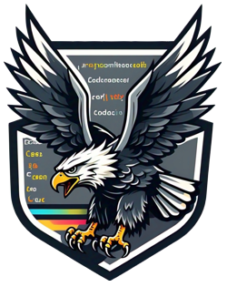

<p align="center">
  
</p>

# AGL (AnotherGoLang)

## Description

AGL is a language that compiles to Go.  
It uses Go's syntax, in fact its lexer/parser is a fork of the original Go implementation, with a few modifications  
The main differences are:  
- Functions return only a single value. This makes it possible to use types like `Option[T]` and `Result[T]`, and to support automatic error propagation via an operator.  
- To make returning multiple values easy, a Tuple type has been introduced. For example: `Result[(u8, string, bool)]`  
- AGL can be used as a scripting language

Notable change: number types are `int i8 i16 i32 i64 uint u8 u16 u32 u64 f32 f64`  

## features

- Tuple / Enum / Set
- Immutable variables/structs by default
- Error propagation operators (`?` for Option[T] / `!` for Result[T])
- Concise anonymous function with type inferred arguments (`other := someArr.Filter({ $0 % 2 == 0 })`)
- Array built-in Map/Reduce/Filter/Find/Sum methods
- Operator overloading
- Compile down to Go code
- VSCode extension & LSP (language server protocol)
- Shell "shebang" support

## How to use

```go
go build               // Build the "agl" executable
./agl main.agl         // Output Go code in stdout
./agl run main.agl     // Run the code directly and output the result in stdout
./agl build main.agl   // Create a main.go file
```

## Error propagation

### Result propagation

```go
package main

import "fmt"

func getInt() int! { // `int!` means the function return a `Result[int]`
    return Ok(42)
}

func intermediate() int! {
    num := getInt()! // Propagate 'Err' value to the caller
    return Ok(num + 1)
}

func main() {
    num := intermediate()! // crash on 'Err' value
    fmt.Println(num)
}
```

### Option propagation

```go
package main

import "fmt"

func maybeInt() int? { // `int?` means the the function return an `Option[int]`
    return Some(42)
}

func intermediate() int? {
    num := maybeInt()? // Propagate 'None' value to the caller
    return Some(num + 1)
}

func main() {
    num := intermediate()? // crash on 'None' value
    fmt.Println(num)
}
```

### Propagation chaining

```go
package main

type Person struct { Name string }

func (p Person) MaybeSelf() Person? {
    return Some(p)
}

func main() {
    bob := Person{Name: "bob"}
    bob.MaybeSelf()?.MaybeSelf()?.MaybeSelf()?
}
```

### `If Some(val) := ... {` to use a Option[T]/Result[T] value safely

This pattern works with any of `Ok`|`Err`|`Some`  

```go
func maybeInt() int? { Some(42) } // Implicit return when a single expression is present

func main() {
    if Some(num) := maybeInt() {
        fmt.Println(num)
    }
}
```

### Match

```go
package main

import "fmt"

func getInt() int! { Ok(42) }

func maybeInt() int? { Some(42) }

func main() {
    match getInt() {
    case Ok(num):
        fmt.Println("Num:", num)
    case Err(err):
        fmt.Println("Error:", err)
    }

    match maybeInt() {
    case Some(num):
        fmt.Println("Num:", num)
    case None:
        fmt.Println("No value")
    }
}
```

### `or_break`/`or_continue`

`or_break`/`or_continue` will `break`/`continue` on a `None`/`Err` value

```go
package main

import "fmt"
import "time"

func test(i int) int? {
    if i >= 2 {
        return None
    }
    return Some(i)
}

func main() {
    for i := 0; i < 10; i++ {
        res := test(i) or_break // `res` has type `int`
        fmt.Println(res)        // will print the value `0` and `1`
        time.Sleep(time.Second)
    }
}
```

## Short anonymous function (type inferred)

Arguments are mapped into `$0`|`$1`...  
In this example, `x` becomes `$0` when using the short form.

| Lang | Expression                                                  |
|------|-------------------------------------------------------------|
| Go   | `utils.Filter(arr, func(x int) bool { return x % 2 == 0 })` |
| AGL  | `arr.Filter({ $0 % 2 == 0 })`                               |

Since the function is expected to return something and there is only one expression, it will be returned automatically.  

```go
package main

type Person struct {
    Name string
    Age int
}

func main() {
    arr := []int{1, 2, 3, 4, 5}
    sum := arr.Filter({ $0 % 2 == 0 }).Map({ $0 + 1 }).Sum()
    assert(sum == 8)

    p1 := Person{Name: "foo", Age: 18}
    p2 := Person{Name: "bar", Age: 19}
    people := []Person{p1, p2}
    names := people.Map({ $0.Name }).Joined(", ")
    sumAge := people.Map({ $0.Age }).Sum()
    assert(names == "foo, bar")
    assert(sumAge == 37)
}
```

## Destructuring

```go
package main

import "fmt"

type IpAddr enum {
    v4(u8, u8, u8, u8)
    v6(string)
}

func main() {
    // enum values can be destructured
    addr1 := IpAddr.v4(127, 0, 0, 1)
    a, b, c, d := addr1

    // tuple can be destructured
    tuple := (1, "hello", true)
    e, f, g := tuple

    fmt.Println(a, b, c, d, e, f, g)
}
```

## Operator overloading

```go
package main

type Person struct {
    Name string
    Age int
}

func (p Person) == (other Person) bool {
    return p.Age == other.Age
}

func main() {
    p1 := Person{Name: "foo", Age: 42}
    p2 := Person{Name: "bar", Age: 42}
    assert(p1 == p2) // People of the same age are obviously equal!
}
```

## Extend built-in types

```go
package main

import "fmt"

func (v agl.Vec[T]) Even() []T {
    out := make([]T, 0)
    for _, el := range v {
        if el % 2 == 0 {
            out = append(out, el)
        }
    }
    return out
}

func main() {
    arr := []int{1, 2, 3, 4, 5, 6, 7, 8}
    res := arr.Even().Filter({ $0 <= 6 }).Map({ $0 + 1 }) 
    //         ^^^^^^ new method available
    fmt.Println(res) // [3 5 7]
}
```

Methods can have generic type parameters

```go
func (v agl.Vec[T]) MyMap[R any](clb func(T) R) []R {
    mut out := make([]R, 0)
    for _, el := range v {
        out = append(out, clb(el))
    }
    return out
}
```

You can also extend for a specific type of vector

```go
func (v agl.Vec[string]) MyJoined(sep string) string {
    return strings.Join(v, sep)
}
```

## Using Go libraries

```go
package main

import (
    "fmt"
    "os"
)

func main() {
    os.WriteFile("test.txt", []byte("test"), 0755)!
    by := os.ReadFile("test.txt")!
    fmt.Println(string(by))
}
```

## Making http request

```go
package main

import (
    "fmt"
    "net/http"
    "io"
)

func main() {
    req := http.NewRequest(http.MethodGet, "https://google.com", None)!
    c := http.Client{}
    resp := c.Do(req)!
    defer resp.Body.Close()
    by := io.ReadAll(resp.Body)!
    fmt.Println(string(by))
}
```

## Scripting

```go
#!/usr/bin/env agl run
package main

import "fmt"

func main() {
    fmt.Println("Hello AGL!")
}
```

```bash
$ chmod +x hello.agl
$ ./hello.agl
Hello AGL!
```
